# Rate Limiter — Revision Guide

A small **machine-coding style** rate limiter in Java: one entry API, multiple algorithms per **user tier**, with **thread-safe** per-user state using `ConcurrentHashMap`.

Use this README to **revisit entities, patterns, structure, and concurrency** quickly.

**Diagrams:** All diagrams below are **[Mermaid](https://mermaid.js.org/)**. They render on **GitHub**, **GitLab**, many IDEs (Mermaid preview), and plugins. Plain editors may show only code fences until previewed.

---

## Table of contents

1. [High-level flow](#high-level-flow)
2. [Entities & responsibilities](#entities--responsibilities)
3. [Design patterns](#design-patterns)
4. [UML diagrams](#uml-diagrams)
5. [Rate-limiting algorithms (what each strategy does)](#rate-limiting-algorithms-what-each-strategy-does)
6. [Thread safety — concepts applied here](#thread-safety--concepts-applied-here)
7. [Project layout](#project-layout)

---

## High-level flow

1. Caller builds a **`User`** (id, tier, timestamp).
2. **`RateLimiter.allowRequest(user)`** delegates to **`RateLimiterImpl`**.
3. **`RateLimiterFactory`** picks a **`RateLimiterStrategy`** from **`UserTier`**.
4. The strategy updates **per-user state** and returns **`true`** (allow) or **`false`** (deny).

### Flowchart (Mermaid)

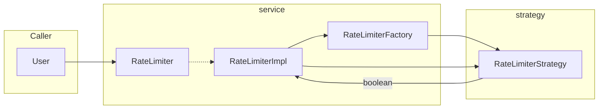

---

## Entities & responsibilities

| Entity | Role |
|--------|------|
| **`User`** | Domain input: `userId`, `UserTier`, `timestamp` (logical “now” for tests or injected clock). |
| **`UserTier`** | Enum: `FREE`, `PREMIUM`, `ENTERPRISE` — selects which algorithm runs. |
| **`RateLimiterConfig`** | Holds knobs: `maxRequests`, `windowDuration`, `capacity`, `refillRate` (not every field is used by every strategy). |
| **`RateLimiter`** | Interface: `boolean allowRequest(User user)`. |
| **`RateLimiterImpl`** | Facade: resolves strategy from tier, guards `null` strategy. |
| **`RateLimiterFactory`** | Maps `UserTier` → shared **`RateLimiterStrategy`** instance. |
| **`RateLimiterStrategy`** | Interface: each algorithm implements `allowRequest`. |
| **`FixedWindowStrategy`** | Fixed window counter per user; state: `WindowState` (`windowIndex`, `count`). |
| **`SlidingWindowStrategy`** | Prior logic preserved: per-user `lastTimestamp` + `requestCount` with gap vs window (not a full timestamp-deque sliding window). |
| **`TokenBucketRateLimiter`** | Per-user token bucket: `BucketState` (`tokens`, `lastRefillTime`). |
| **`Main`** | Demo / manual runs. |

**Inner state types (per user, inside strategies):**

- **`WindowState`** — current fixed-window id and count in that window.
- **`SlidingState`** — last timestamp and running count for the premium heuristic.
- **`BucketState`** — fractional tokens and last refill time.

---

## Design patterns

| Pattern | Where | Why it helps |
|---------|--------|----------------|
| **Strategy** | `RateLimiterStrategy` + `FixedWindowStrategy`, `SlidingWindowStrategy`, `TokenBucketRateLimiter` | Swap algorithms without changing callers; each tier can use a different policy. |
| **Simple Factory** | `RateLimiterFactory.getRateLimiter(UserTier)` | Central place to construct / bind strategies to tiers; callers don’t `new` concrete strategies. |
| **Facade** | `RateLimiterImpl` | Single simple API (`RateLimiter`) hiding factory + strategy dispatch. |
| **Singleton (per tier)** | `Map.of(...)` in factory — one strategy instance per tier | Shared limiter process-wide; correctness depends on **thread-safe** strategy internals. |

---

## UML diagrams (Mermaid)

### Class diagram — packages & relationships

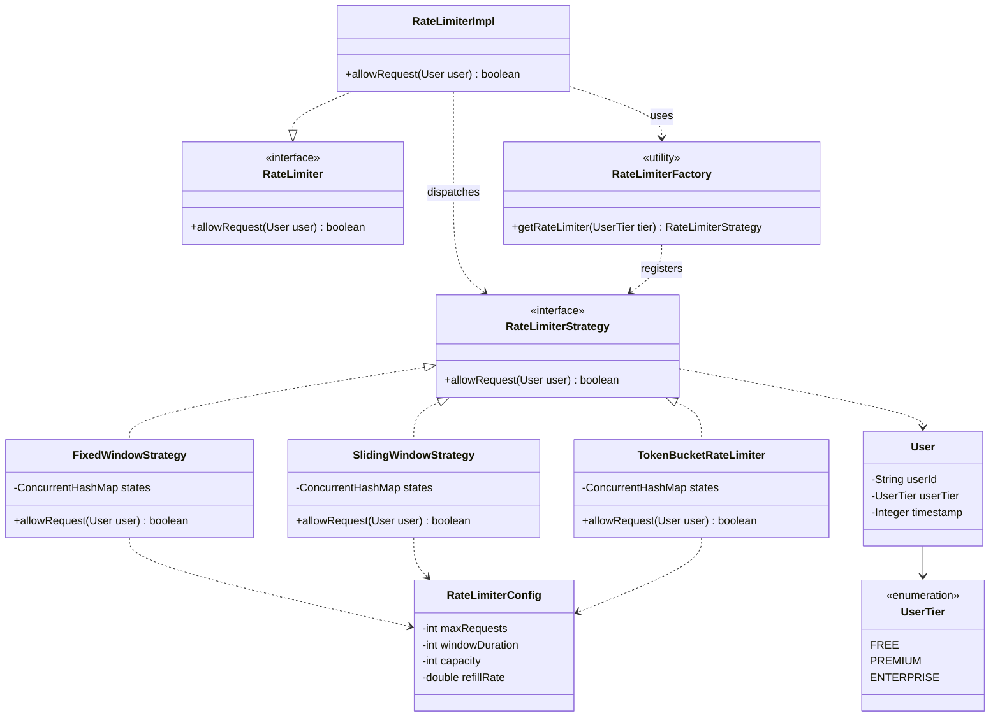

*(Packages: `model` — User, UserTier, RateLimiterConfig · `service` — RateLimiter, RateLimiterImpl · `factory` — RateLimiterFactory · `strategy` — RateLimiterStrategy + implementations.)*

### Sequence diagram — `allowRequest`

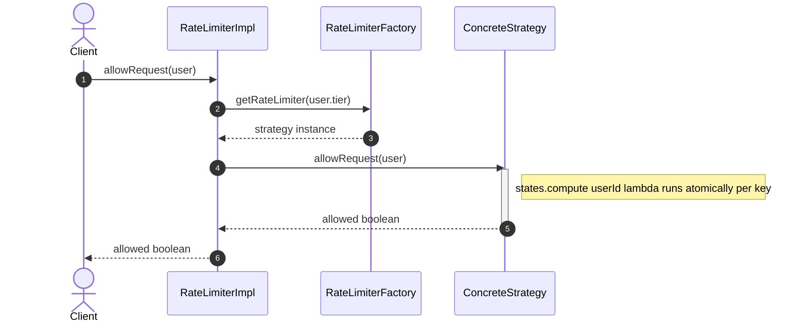

### Tier → strategy mapping (factory)

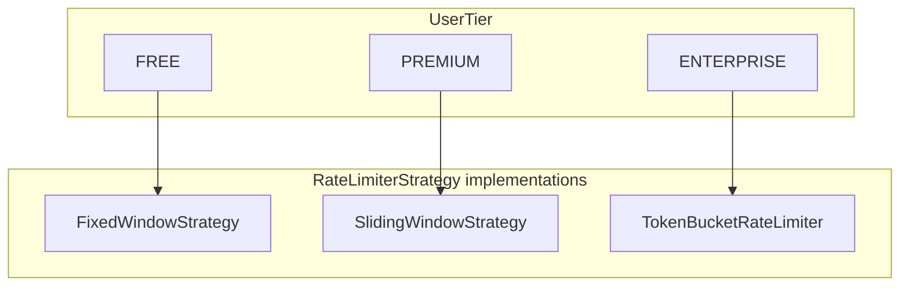

---

## Rate-limiting algorithms (what each strategy does)

| Strategy | Idea (short) |
|----------|----------------|
| **Fixed window** | Split time into buckets of length `windowDuration`. Allow up to `maxRequests` per bucket per user; new bucket resets count. |
| **Sliding (current impl)** | Uses time gap since last stored timestamp vs `windowSize` and a counter — **not** the classic “deque of timestamps in last W seconds”. Good to rename or extend if you need true sliding window. |
| **Token bucket** | Bucket capacity `capacity`, refill at `refillRate` per second (same time unit as `User.timestamp`). Each allowed request consumes **1** token; refill based on elapsed time since `lastRefillTime`. |

---

## Thread safety — concepts applied here

### 1. What problem are we solving?

Many threads can call `allowRequest` **at the same time**, possibly for the **same `userId`**. Without care you get **race conditions**: two threads both “see” count `1`, both think another request is allowed, both increment → **lost update** or **limit exceeded**.

This is the classic **check-then-act** problem:

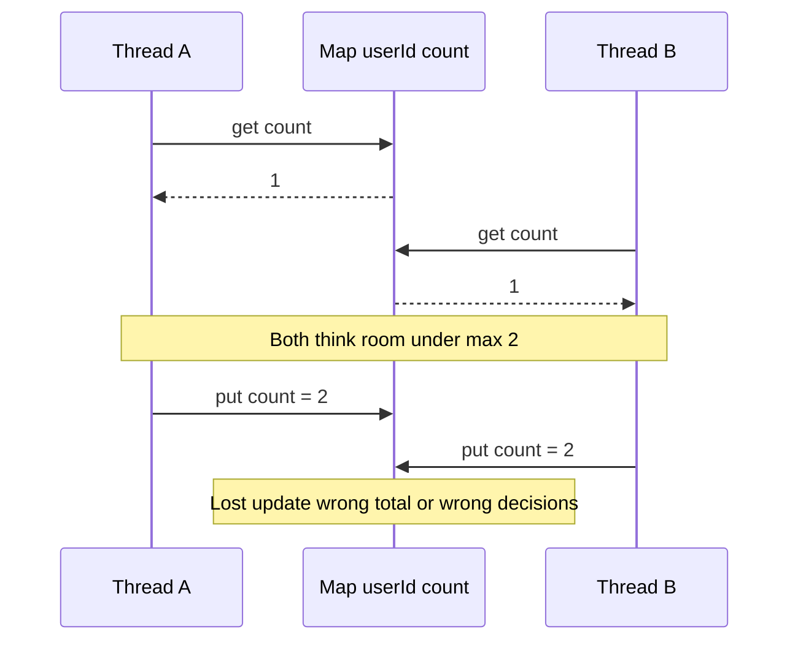

So the **read + decision + write** for one user must be **atomic** (indivisible) *for that user’s state*.

---

### 2. Why only replacing `HashMap` with `ConcurrentHashMap` is not enough

`ConcurrentHashMap` prevents internal corruption when many threads use the map and enables **atomic single-key operations** *if you use them correctly*.

If you still write non-atomic **get → if → put**:

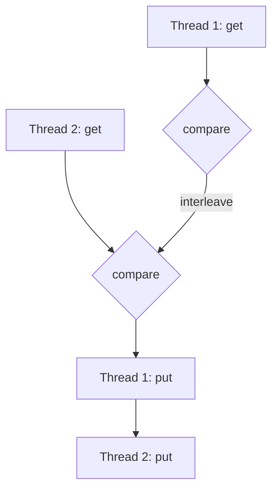

…two threads can interleave between `get` and `put`. **The map is safe; your logic is not.**

So you must either:

- Hold a **lock** around the whole get-decide-put for that user, or  
- Use one **atomic** map operation that runs your logic inside it — e.g. **`compute(key, remappingFunction)`**.

---

### 3. What this project does: `ConcurrentHashMap.compute`

For each strategy, **all mutable state for a user** lives in **one** value object (`WindowState`, `SlidingState`, `BucketState`) stored under **`userId`**.

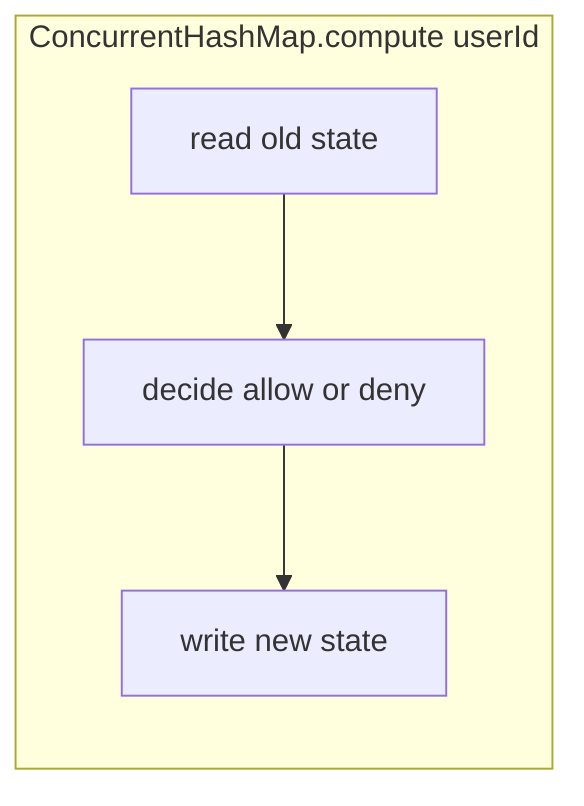

For a given key, **`compute`** ensures the remapping function runs **atomically** (no other `compute`/etc. on that key runs in between). So **two threads for the same user** cannot both read stale state and both increment incorrectly.

**Different users** use **different keys**, so their `compute` calls **do not block each other** (scalability vs one global `synchronized` method).

---

### 4. Concrete example (same user, two threads)

Settings: **fixed window**, `maxRequests = 2`, same window — **correct behavior with `compute`**:

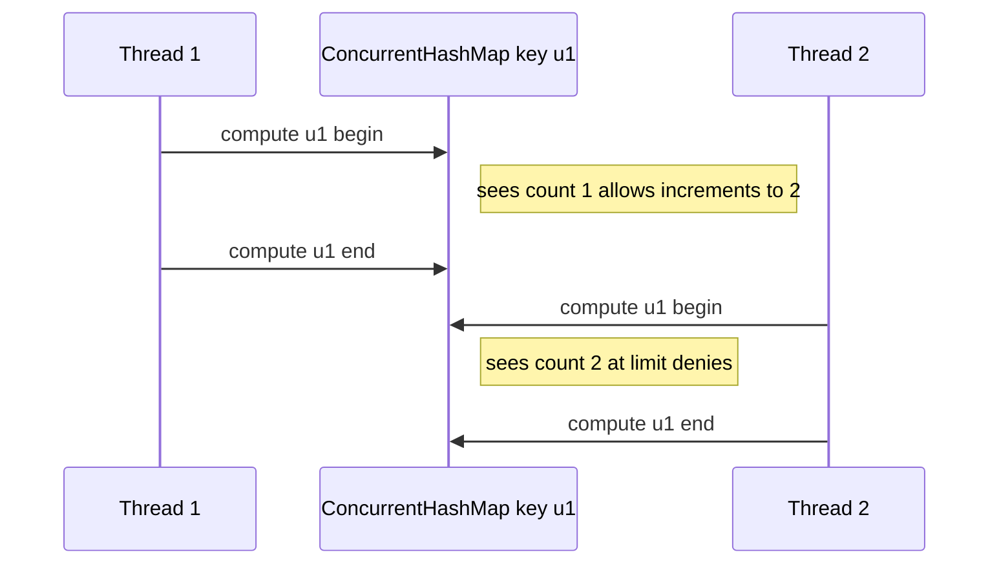

If both ran **without** atomic `compute` (classic race):

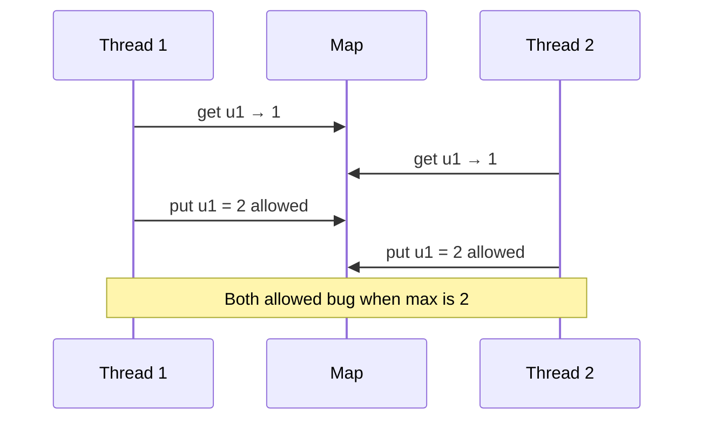

With **`compute`**, Thread 2’s run sees the **updated** state from Thread 1 → the second concurrent allow can be denied correctly.

---

### 5. Why inner state is one object per user

Older designs used **two maps** (e.g. window id map + count map). Updating them separately meant **two atomic steps** — another thread could observe **inconsistent** pairs (window from epoch A, count from epoch B).

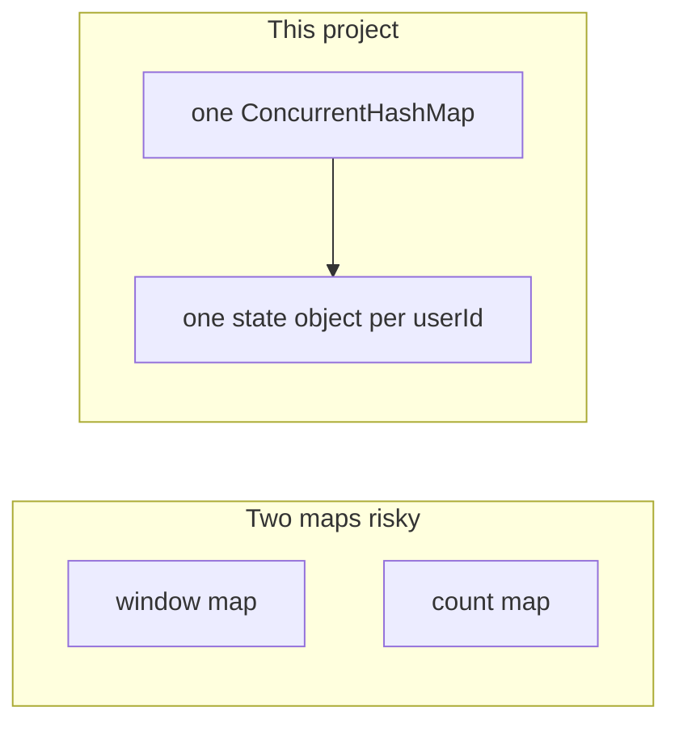

Here: **one map**, **one value** → **one `compute`** updates **everything** for that user together.

---

### 6. `AtomicBoolean` in strategies

The lambda passed to `compute` must return the **new state object**, not `boolean`. The code uses **`AtomicBoolean`** (or could use `boolean[1]`) to record **allow/deny** *inside* the lambda and read it **after** `compute` returns. That boolean is **not** what makes updates atomic — **`compute`** does. It is only an **out-parameter** from the lambda.

---

### 7. Factory and `null` tier

`RateLimiterImpl` checks **`strategy == null`** so an unknown tier does not cause **`NullPointerException`** inside `allowRequest`.

---

### 8. Limits of this model (for interviews)

- **Single JVM** — threads see one memory. **Distributed** rate limiting needs Redis / centralized store / coordination.
- **Fairness / starvation** — not addressed; token bucket and windows focus on counts only.
- **`User.timestamp`** — must be consistent (same unit as config). Production often uses **`Clock`** / **`Instant`** injection instead of caller-supplied ints.

---

## Project layout

### Folder tree (Mermaid)

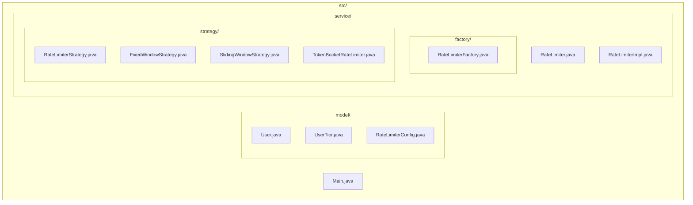

---

## Quick compile (no build tool)

```bash
mkdir -p out && javac -d out $(find src -name "*.java")
java -cp out Main
```

*(Adjust classpath if your IDE uses a different output folder.)*

---

*Last aligned with: Strategy + Factory + Facade; per-user `ConcurrentHashMap.compute`; fixed / sliding heuristic / token bucket implementations.*
